# Dot Matrix Studio (modulo)

面向嵌入式开发者的**在线取模工具箱**:把图片、视频、GIF 动画、字体、音频、手绘图形一键转换为可直接烧录的 C 数组(`uint8_t[]`),并内置 AI 助手为目标硬件自动生成驱动整合代码。

纯前端实现(Vue 3 + TypeScript + Pinia + Vite),所有图像处理在浏览器本地完成,素材不上传服务器。

## ✨ 功能总览

| 模块 | 说明 |
|---|---|
| 🖼 图片取模 | 单张图片 → 点阵 C 数组,支持单色/灰度/RGB565 等色彩模式 |
| ▶ 视频取模 | 视频按帧率抽帧,批量输出帧数组 |
| ◧ 动画取模 | GIF / APNG 逐帧解码取模(按文件魔数识别,不受扩展名误导) |
| 字 字模提取 | 任意系统字体/字号的字符点阵字模 |
| ≣ 批量取模 | 多张图片一次性处理,统一参数导出 |
| ✎ 手绘取模 | 在网格画布上直接绘制图形并取模 |
| ♪ 音频取模 | 音频波形/采样数据转数组 |
| ✦ AI 整合 | 把取模代码交给 AI,自动生成目标设备(OLED/LCD/点阵屏)+ 平台(ESP32/STM32/Arduino)的完整驱动代码 |
| 👤 用户系统 | 注册(邮箱验证码)/ 登录 / 个人中心,头像取用户名首字,水印绑定账户 |
| 🌐 双语 | 中文 / English 一键切换 |

---

## 📷 页面与功能介绍

### 首页

每个工具卡片内嵌一段**实时像素动画演示**,直观展示该工具的输出效果。

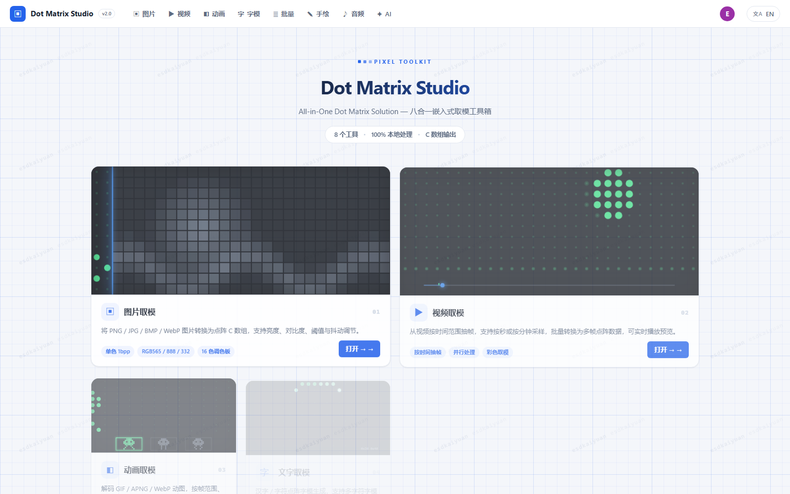

### 图片取模

拖放或选择 PNG / JPG / BMP / WebP,实时预览点阵效果。

- **输出尺寸**:自定义宽高或等比缩放
- **处理参数**:颜色模式(单色 1bpp / 灰度 / 彩色)、亮度、对比度、阈值、缩放算法(最近邻/双线性)、Floyd–Steinberg 抖动
- **编码设置**:扫描方向、位序(MSB/LSB)、极性
- 输出带统计信息的 C 数组,一键复制或下载 `.h` 文件

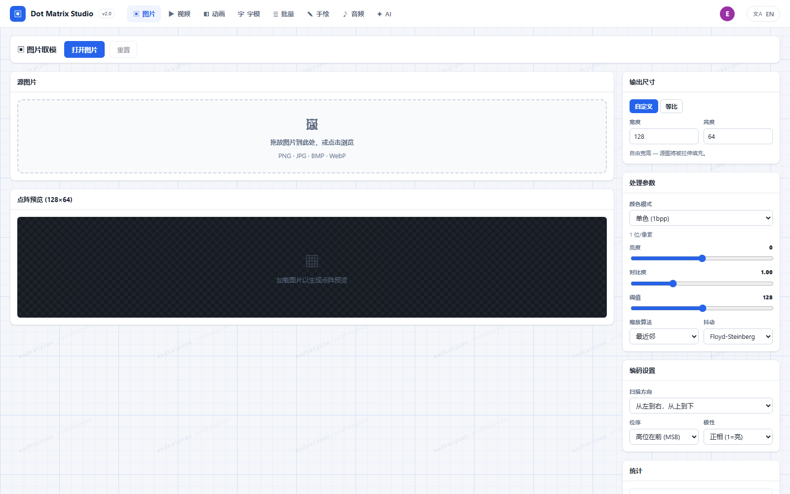

### 视频取模

加载本地视频,设定抽帧帧率与输出尺寸,批量提取帧并生成帧序列数组,适合做屏幕开机动画。

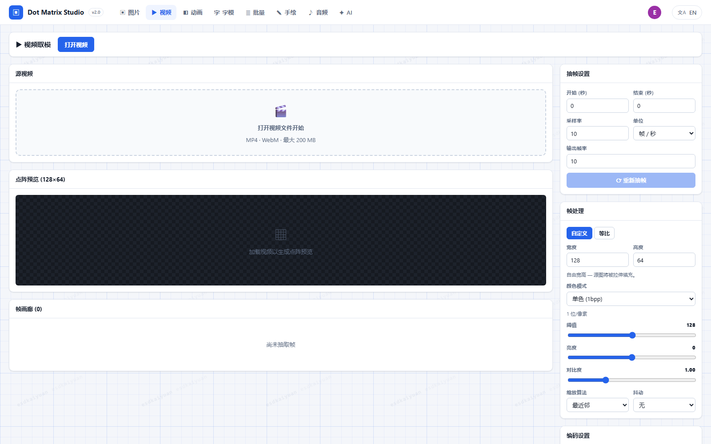

### 动画取模

GIF / APNG 动画逐帧解码(按文件魔数嗅探格式),每帧独立取模,输出帧数组与帧时长表。

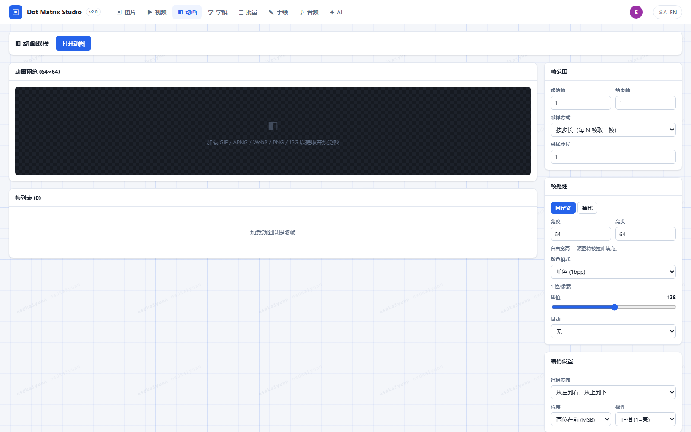

### 字模提取

选择字体、字号、字符集,生成字符点阵字模;支持与图片取模一致的编码选项,适配常见点阵屏驱动的取模格式。

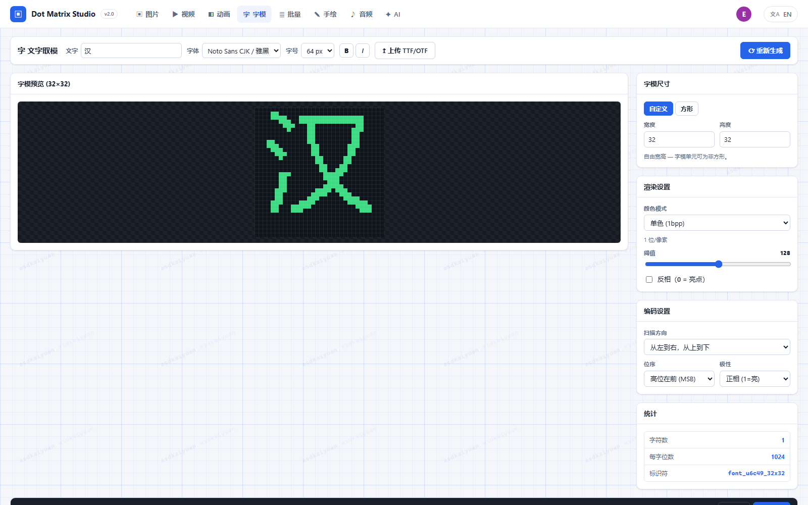

### 批量取模

一次导入多张图片,共用一套处理/编码参数,逐张或合并导出,适合图标集打包。

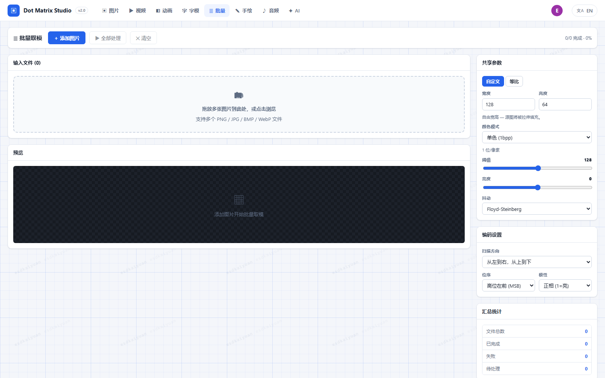

### 手绘取模

像素级画布编辑器:画笔/橡皮直接点绘,实时生成数组,适合快速画小图标、自定义字符。

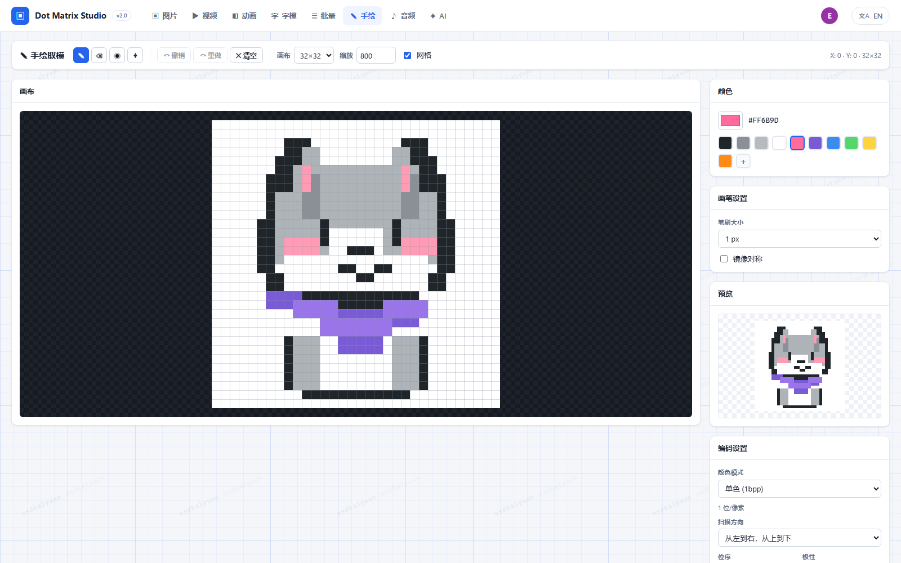

### 音频取模

导入音频文件,提取波形采样数据为 C 数组,用于蜂鸣器旋律、简易音频播放等场景。

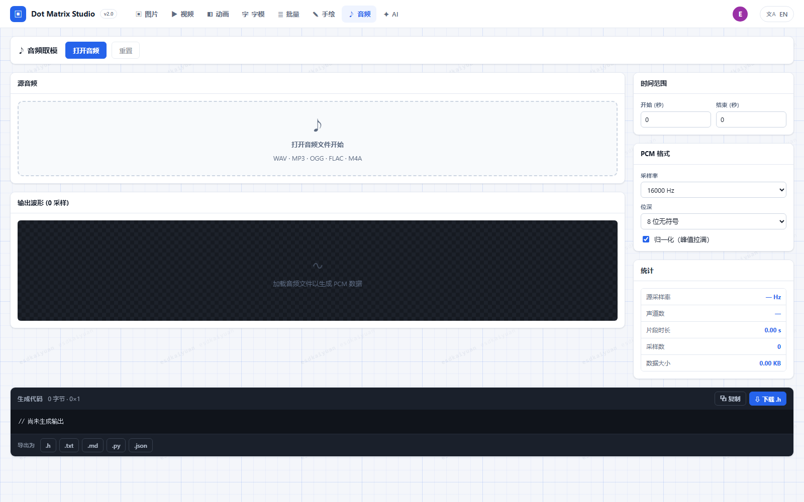

### AI 整合

把本工具箱导出的取模代码(拖入 `.h/.c/.txt/.ino` 或直接粘贴)交给 AI:

- **服务商预设**:DeepSeek / Kimi / 智谱 GLM / OpenAI / Anthropic / Ollama(本地),也可填任意 OpenAI 兼容端点;可在线拉取模型列表
- **目标设备**:SSD1306 / ST7735 等显示屏、LED 点阵等,自选总线协议(I2C/SPI/并口)与引脚
- 自动生成协议驱动、封装函数与调用示例,支持追加要求**迭代优化**,结果可按文件下载
- API 密钥仅保存在本机浏览器,请求直连 AI 服务,不经过任何中间服务器

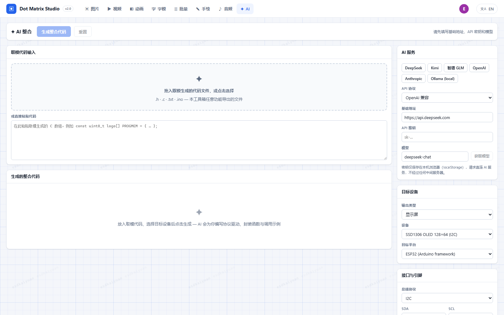

### 登录 / 注册

左侧轮播七个工具的像素动画展示本站特色,右侧为表单:

- 注册需**邮箱验证码**(esdkaiyuan 邮箱验证服务),含用户名/邮箱/密码强度实时校验
- 密码以加盐 SHA-256 哈希存储,绝不保存明文

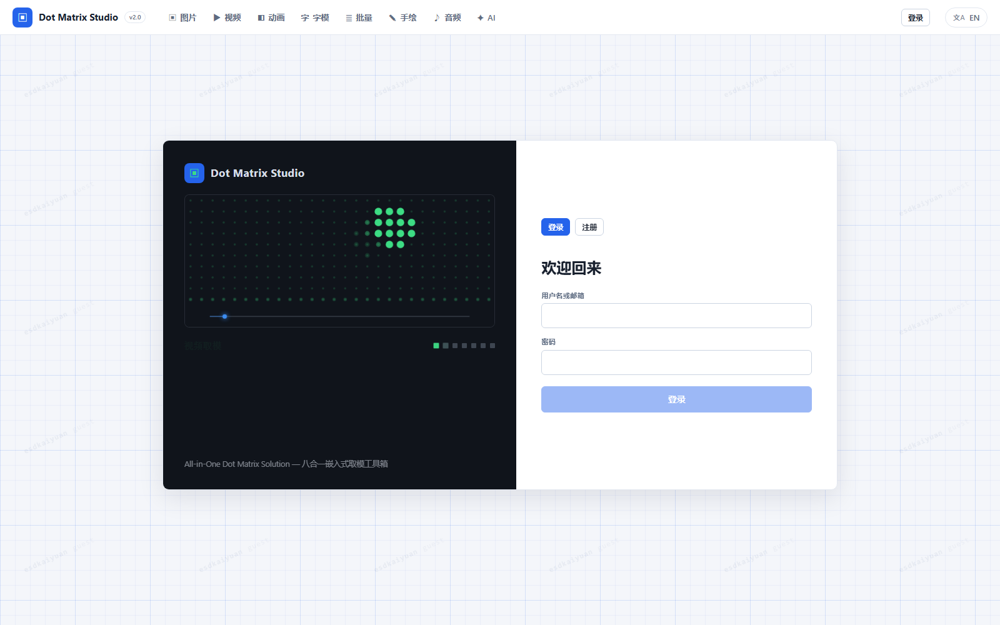

### 个人中心

- 头像 = 用户名首字(按用户名散列着色)
- **使用统计**:累计次数、工具覆盖、活跃天数、注册天数
- **12 周使用热力图** + 各工具使用分布 + 最近动态
- 账户管理:改用户名、改密码、退出、注销(数据一并清除)
- 全站背景**对角线水印**:`esdkaiyuan + 用户名`,随登录状态实时切换(未登录显示 guest)

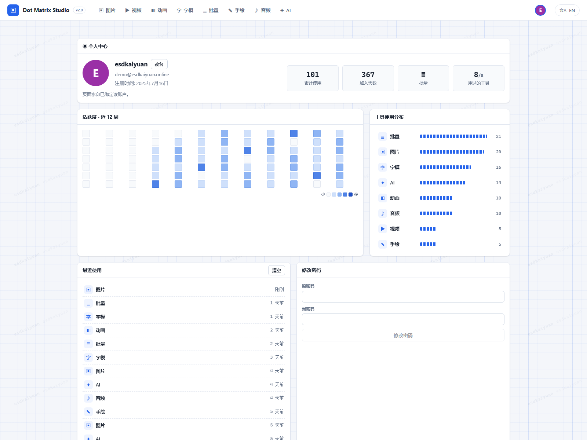

---

## 🛠 技术栈

- **框架**:Vue 3(`<script setup>`)+ TypeScript + Pinia + Vite
- **图像处理**:Canvas API + 自研取模引擎(灰度化、抖动、扫描编码),Web Worker 加速
- **数据持久化**:localStorage + IndexedDB 双写(账户、使用历史、AI 配置按账户隔离)
- **国际化**:自研轻量 i18n,中英文全覆盖,键位由类型系统保证同步
- **测试**:Vitest(引擎与 Store 单元测试)

## 🚀 本地开发

```bash
npm install
npm run dev        # http://localhost:5173
npm run build      # 产物输出到 dist/
npx vue-tsc --noEmit   # 类型检查
npx vitest run     # 单元测试(需 Node 18+)
```

## 📦 部署注意

邮箱验证服务不允许任意浏览器跨域,开发环境由 Vite 代理 `/mailapi` → `https://youxiangyanzheng.esdkaiyuan.online/api/v1`(见 `vite.config.ts`)。**生产环境需在反向代理(Nginx 等)上配置同名 `/mailapi` 前缀转发**,例如:

```nginx
location /mailapi/ {
  proxy_pass https://youxiangyanzheng.esdkaiyuan.online/api/v1/;
}
```

## 🔒 安全说明

- 账户体系为**纯客户端实现**(localStorage/IndexedDB),适合个人与小团队场景;如需对抗恶意用户请接入后端鉴权
- AI 密钥只存本机、按账户隔离,退出登录即清除表单
- 邮箱验证 API Key 打包在前端,建议后续迁移至服务端代理
