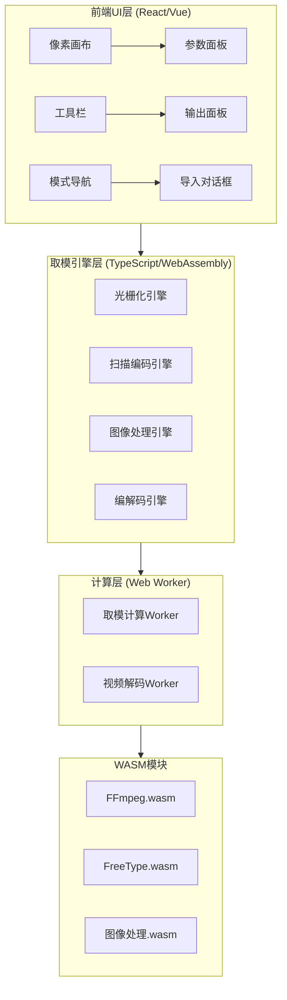
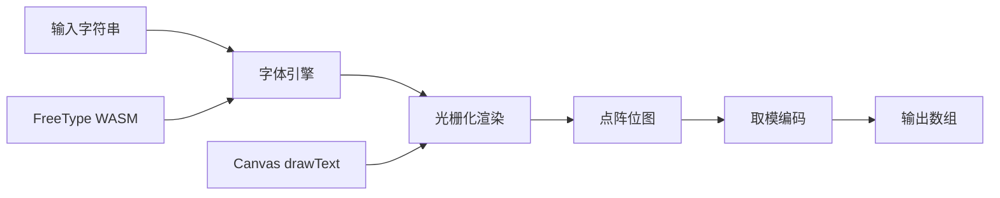
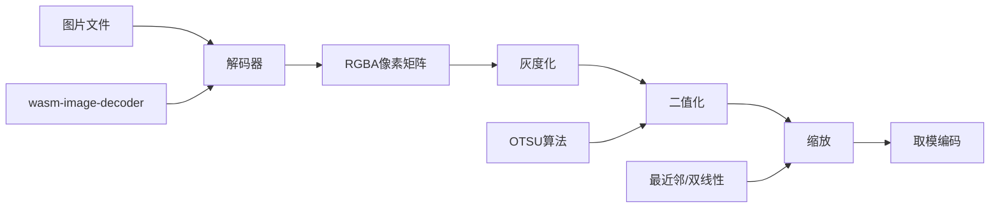
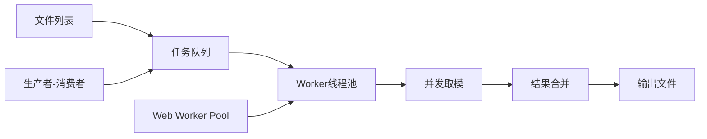
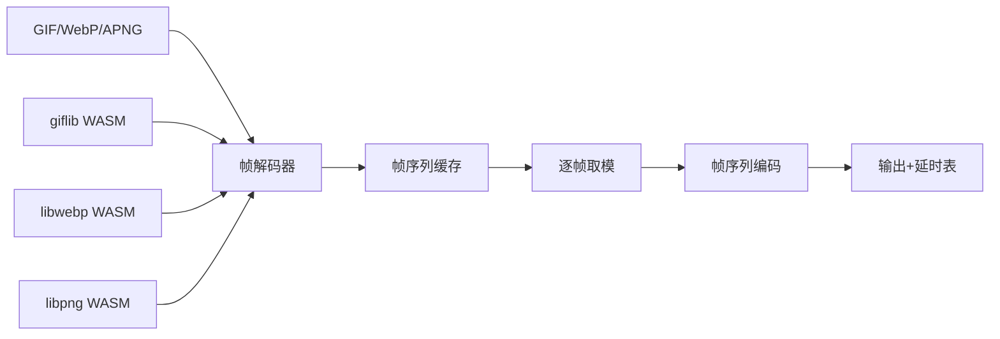
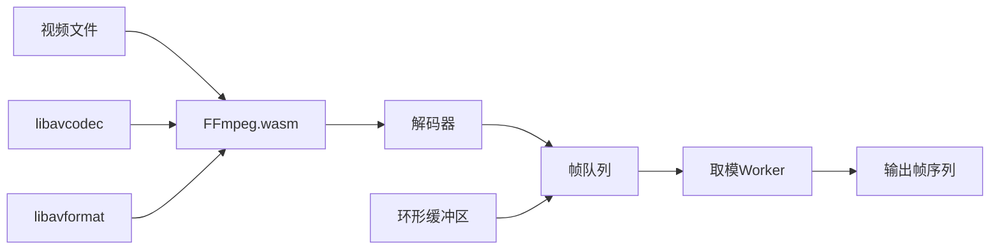
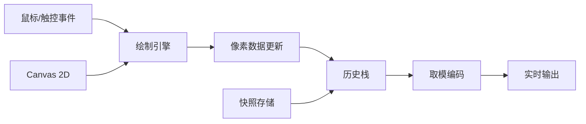

---

# 点阵取模工具 —— 完整技术实现方案

---

## 一、总体技术架构



---

## 二、核心技术栈总表

| 层级 | 技术选型 | 版本 | 用途 |
|------|----------|------|------|
| **前端框架** | React 18 + TypeScript 5 | 18.2.0 / 5.0+ | UI组件与逻辑 |
| **UI组件库** | Ant Design 5 | 5.12.0+ | 基础控件（下拉/滑块/按钮/布局） |
| **状态管理** | Zustand | 4.4.0+ | 全局状态与数据流 |
| **画布渲染** | HTML5 Canvas 2D API | — | 像素网格绘制与交互 |
| **取模引擎** | 原生TypeScript实现 | — | 扫描/编码/二值化核心算法 |
| **图像解码** | `@wasm-codecs/image` / `wasm-image-decoder` | — | PNG/JPEG/BMP/GIF解码 |
| **字体渲染** | `@jspm/freetype` (FreeType WASM) | — | 矢量字体光栅化 |
| **视频/动图解码** | `@ffmpeg/ffmpeg` (FFmpeg.wasm) | 0.12.0+ | MP4/AVI/WebP/GIF解码 |
| **语法高亮** | Prism.js | 1.29.0+ | 输出面板C代码高亮 |
| **构建工具** | Vite | 5.0+ | 开发与打包 |
| **测试框架** | Vitest + React Testing Library | — | 单元测试与组件测试 |
| **性能优化** | Web Worker + OffscreenCanvas | — | 异步计算与离屏渲染 |

---

## 三、各功能模块底层实现技术栈（核心）

### 1. 文本/汉字取模模块

#### 底层技术路线



#### 技术实现细节

| 步骤 | 实现技术 | 关键API/库 | 说明 |
|------|----------|------------|------|
| **字体加载** | `@jspm/freetype` (FreeType WASM) | `FT_New_Face`, `FT_Set_Char_Size` | 加载TTF/OTF字体文件，支持自定义字体 |
| **字形光栅化** | FreeType渲染引擎 | `FT_Load_Glyph`, `FT_Render_Glyph` | 将矢量字形渲染为灰度点阵（8-bit） |
| **备用方案** | Canvas 2D `fillText` + `getImageData` | `ctx.fillText`, `ctx.getImageData` | 降级方案，利用浏览器原生字体渲染 |
| **二值化** | 固定阈值 / 自适应阈值 | 手动实现 / OTSU算法 | 将灰度点阵转为0/1二值数据 |
| **字符缓存** | LRU Cache | 手动实现 | 避免重复渲染相同字符 |

#### 核心代码示例

```typescript
// 使用Canvas作为备用字体渲染引擎
function renderTextToBitmap(text: string, font: string, size: number): ImageData {
  const canvas = document.createElement('canvas');
  const ctx = canvas.getContext('2d')!;
  
  // 测量文本宽度
  ctx.font = `${size}px ${font}`;
  const metrics = ctx.measureText(text);
  const width = Math.ceil(metrics.width);
  const height = size * 1.2;
  
  canvas.width = width;
  canvas.height = height;
  
  // 绘制文本
  ctx.font = `${size}px ${font}`;
  ctx.textBaseline = 'top';
  ctx.fillText(text, 0, 0);
  
  // 提取像素数据
  return ctx.getImageData(0, 0, width, height);
}

// FreeType WASM方案（更精确控制）
async function renderWithFreeType(text: string, fontBuffer: ArrayBuffer, size: number) {
  const freetype = await initializeFreeType();
  const face = freetype.newFace(fontBuffer, 0);
  face.setCharSize(size * 64, size * 64, 96, 96); // 64为FreeType的26.6定点单位
  
  const bitmap = face.renderGlyph(text.charCodeAt(0));
  // bitmap.buffer 为Uint8Array灰度数据
  return bitmap;
}
```

---

### 2. 图片取模模块

#### 底层技术路线



#### 技术实现细节

| 步骤 | 实现技术 | 关键算法/库 | 说明 |
|------|----------|-------------|------|
| **图片解码** | `wasm-image-decoder` (WASM) | PNG/JPEG/BMP/WebP解码器 | 支持主流图片格式 |
| **备用方案** | `createImageBitmap` + Canvas | `drawImage` + `getImageData` | 浏览器原生解码 |
| **灰度化** | 亮度公式 | `Gray = 0.299R + 0.587G + 0.114B` | ITU-R BT.709标准 |
| **二值化** | OTSU大津法（自适应阈值） | 最大化类间方差 | 自动计算最优阈值 |
| **手动阈值** | 用户滑块控制 | — | 0-255范围调节 |
| **抖动算法** | Floyd-Steinberg误差扩散 | 有/无色阶减少 | 提升视觉质量 |
| **缩放算法** | 最近邻 / 双线性 / 双三次 | 手动实现矩阵插值 | 缩放到目标点阵尺寸 |
| **旋转/翻转** | 矩阵变换 | 手动实现 | 支持90°/180°/270°旋转 |

#### 核心算法实现

```typescript
// OTSU自动二值化
function otsuThreshold(grayData: Uint8Array): number {
  const histogram = new Uint32Array(256);
  let totalPixels = grayData.length;
  
  // 统计灰度直方图
  for (let i = 0; i < totalPixels; i++) {
    histogram[grayData[i]]++;
  }
  
  let sum = 0;
  for (let i = 0; i < 256; i++) {
    sum += i * histogram[i];
  }
  
  let sumB = 0, wB = 0, wF = 0;
  let varMax = 0, threshold = 0;
  
  for (let t = 0; t < 256; t++) {
    wB += histogram[t];                    // 背景权重
    if (wB === 0) continue;
    
    wF = totalPixels - wB;                 // 前景权重
    if (wF === 0) break;
    
    sumB += t * histogram[t];
    const mB = sumB / wB;                  // 背景均值
    const mF = (sum - sumB) / wF;          // 前景均值
    
    const between = wB * wF * (mB - mF) * (mB - mF);
    if (between > varMax) {
      varMax = between;
      threshold = t;
    }
  }
  return threshold;
}

// Floyd-Steinberg抖动
function floydSteinberg(grayData: Uint8Array, width: number, height: number): Uint8Array {
  const result = new Uint8Array(grayData);
  const error = new Float32Array(grayData);
  
  for (let y = 0; y < height; y++) {
    for (let x = 0; x < width; x++) {
      const idx = y * width + x;
      const oldPixel = result[idx] + error[idx];
      const newPixel = oldPixel < 128 ? 0 : 255;
      result[idx] = newPixel;
      
      const quantError = oldPixel - newPixel;
      // 向周围像素扩散误差 (Floyd-Steinberg系数)
      if (x + 1 < width) error[idx + 1] += quantError * 7 / 16;
      if (x - 1 >= 0 && y + 1 < height) error[idx - 1 + width] += quantError * 3 / 16;
      if (y + 1 < height) error[idx + width] += quantError * 5 / 16;
      if (x + 1 < width && y + 1 < height) error[idx + 1 + width] += quantError * 1 / 16;
    }
  }
  return result.map(v => v > 128 ? 1 : 0);
}
```

---

### 3. 批量取模模块

#### 底层技术路线



#### 技术实现细节

| 步骤 | 实现技术 | 关键API/库 | 说明 |
|------|----------|------------|------|
| **文件遍历** | `File System Access API` / 拖拽 | `showDirectoryPicker`, `dataTransfer` | 支持目录导入 |
| **任务调度** | 生产者-消费者模式 | 手动实现队列 + 信号量 | 管理并发取模任务 |
| **并发执行** | Web Worker线程池 | `Worker` + `SharedArrayBuffer` | 多核并行取模 |
| **进度监控** | Worker消息回调 | `postMessage` / `onmessage` | 实时更新进度条 |
| **结果聚合** | 主线程合并 | 手动实现 | 按顺序拼接输出 |
| **错误隔离** | try-catch + 错误队列 | — | 单个失败不影响整体 |

#### 核心实现

```typescript
// Worker Pool实现
class WorkerPool {
  private workers: Worker[] = [];
  private idleWorkers: Worker[] = [];
  private taskQueue: Task[] = [];
  private results: Map<string, Uint8Array> = new Map();
  
  constructor(workerScript: string, poolSize: number = navigator.hardwareConcurrency) {
    for (let i = 0; i < poolSize; i++) {
      const worker = new Worker(workerScript, { type: 'module' });
      worker.onmessage = this.handleWorkerMessage.bind(this);
      this.workers.push(worker);
      this.idleWorkers.push(worker);
    }
  }
  
  submit(task: Task): Promise<Uint8Array> {
    return new Promise((resolve, reject) => {
      this.taskQueue.push({ ...task, resolve, reject });
      this.scheduleNext();
    });
  }
  
  private scheduleNext() {
    if (this.taskQueue.length === 0 || this.idleWorkers.length === 0) return;
    
    const worker = this.idleWorkers.pop()!;
    const task = this.taskQueue.shift()!;
    worker.postMessage({ 
      type: 'process', 
      data: task.imageData,
      params: task.params 
    });
    // 存储回调
    this.pendingCallbacks.set(worker, { resolve: task.resolve, reject: task.reject });
  }
}
```

---

### 4. 动图取模模块

#### 底层技术路线



#### 技术实现细节

| 步骤 | 实现技术 | 关键库/API | 说明 |
|------|----------|------------|------|
| **GIF解码** | `giflib` WASM封装 | `DGifOpen`, `DGifGetRecord` | 提取GIF所有帧 |
| **WebP解码** | `libwebp` WASM封装 | `WebPDecode`, `WebPGetInfo` | 动图WebP解码 |
| **APNG解码** | `libpng` WASM封装 | `png_read_image` + 扩展块解析 | 解析acTL/fcTL帧控制块 |
| **帧缓存策略** | 分批加载 + LRU淘汰 | 手动实现 | 避免大动图OOM |
| **帧抽取** | 等间隔采样 | — | 如每2帧取1帧 |
| **帧尺寸统一** | 缩放引擎 | 双线性插值 | 所有帧缩放到相同尺寸 |
| **延时提取** | 解析帧控制扩展 | GIF: Graphic Control Extension | 提取每帧延时(单位: 1/100秒) |
| **输出格式** | 帧数组 + 延时数组 | TypeScript结构体 | `{ frames: Uint8Array[], delays: number[] }` |

#### 核心实现

```typescript
// GIF解码（使用giflib WASM）
async function decodeGIF(file: ArrayBuffer): Promise<GIFData> {
  const giflib = await loadGiflib();
  const gif = giflib.DGifOpen(file);
  
  const frames: Uint8Array[] = [];
  const delays: number[] = [];
  
  while (true) {
    const record = giflib.DGifGetRecord(gif);
    if (!record) break;
    
    if (record.type === 'IMAGE_DESC') {
      // 提取帧像素数据
      const pixels = giflib.DGifGetImage(gif);
      // 转换为灰度+二值化
      const bitmap = processFrame(pixels, record.width, record.height);
      frames.push(bitmap);
    }
    
    if (record.type === 'GRAPHIC_CONTROL') {
      // 提取延时信息
      delays.push(record.delayTime * 10); // 转换为毫秒
    }
  }
  
  giflib.DGifClose(gif);
  return { frames, delays, loopCount: gif.loopCount };
}
```

---

### 5. 视频取模模块

#### 底层技术路线



#### 技术实现细节

| 步骤 | 实现技术 | 关键API/库 | 说明 |
|------|----------|------------|------|
| **视频解码** | FFmpeg.wasm (libavcodec) | `FFmpeg.load()`, `FFmpeg.exec()` | 解码MP4/AVI/MOV/MKV |
| **帧抽取** | 时间戳采样 | `AVPacket.pts`, `AVFrame.pts` | 按指定FPS抽取帧 |
| **帧缓存** | 环形缓冲区 (Ring Buffer) | 手动实现 | 解码线程与取模线程解耦 |
| **流水线处理** | 生产者-消费者管道 | Web Worker + SharedArrayBuffer | 解码-取模-输出三级流水 |
| **硬件加速** | 可选 (WebCodecs API) | `VideoDecoder` (Chrome) | 浏览器原生硬件解码 |
| **输出格式** | 与动图模块兼容 | 帧序列 + 元数据 | 复用动图输出结构 |

#### 核心实现

```typescript
// FFmpeg.wasm视频解码
async function decodeVideo(file: File, fps: number): Promise<VideoFrames> {
  const ffmpeg = new FFmpeg();
  await ffmpeg.load();
  
  // 写入输入文件
  const fileName = 'input.mp4';
  await ffmpeg.writeFile(fileName, await file.arrayBuffer());
  
  // 执行解码 + 帧抽取
  await ffmpeg.exec([
    '-i', fileName,
    '-vf', `fps=${fps}`,      // 抽取帧率
    '-pix_fmt', 'gray',       // 灰度输出
    '-f', 'rawvideo',         // 原始像素数据
    'output.raw'
  ]);
  
  // 读取解码后的原始帧数据
  const rawData = await ffmpeg.readFile('output.raw');
  const frameSize = width * height;
  const totalFrames = rawData.byteLength / frameSize;
  
  const frames: Uint8Array[] = [];
  for (let i = 0; i < totalFrames; i++) {
    const offset = i * frameSize;
    const frame = new Uint8Array(rawData.slice(offset, offset + frameSize));
    // 二值化处理
    frames.push(binarizeFrame(frame));
  }
  
  return { frames, width, height, totalFrames };
}
```

---

### 6. 手绘取模模块

#### 底层技术路线



#### 技术实现细节

| 步骤 | 实现技术 | 关键API/库 | 说明 |
|------|----------|------------|------|
| **画布渲染** | Canvas 2D Context | `fillRect`, `strokeRect`, `putImageData` | 高性能像素绘制 |
| **交互事件** | Pointer Events API | `pointerdown`, `pointermove`, `pointerup` | 统一鼠标/触控 |
| **坐标转换** | 视口变换矩阵 | 手动实现矩阵运算 | 屏幕坐标 → 像素坐标 |
| **铅笔工具** | 鼠标拖拽填充 | 检测悬停格 + 连续填充 | 支持左键填1/右键填0 |
| **泛洪填充** | BFS/DFS算法 | 手动实现 | 连通区域替换 |
| **撤销/重做** | 历史栈快照 | `Uint8Array`深拷贝 + 压缩 | 支持30步历史 |
| **缩放平移** | Canvas transform | `ctx.translate()`, `ctx.scale()` | GPU加速变换 |
| **性能优化** | 离屏Canvas + 脏矩形 | OffscreenCanvas + 区域重绘 | 大画布流畅绘制 |

#### 核心实现

```typescript
// Canvas交互核心
class PixelCanvasEngine {
  private canvas: HTMLCanvasElement;
  private ctx: CanvasRenderingContext2D;
  private offscreen: OffscreenCanvas;
  private offCtx: OffscreenCanvasRenderingContext2D;
  
  private data: Uint8Array;          // 像素数据 0/1
  private width: number;
  private height: number;
  private zoom: number = 1;
  private panX: number = 0;
  private panY: number = 0;
  
  private history: Uint8Array[] = [];
  private historyIndex: number = -1;
  private maxHistory: number = 30;
  
  constructor(canvas: HTMLCanvasElement, width: number, height: number) {
    this.canvas = canvas;
    this.ctx = canvas.getContext('2d')!;
    this.width = width;
    this.height = height;
    this.data = new Uint8Array(width * height);
    
    // 离屏Canvas用于缓存完整渲染结果
    this.offscreen = new OffscreenCanvas(width, height);
    this.offCtx = this.offscreen.getContext('2d')!;
  }
  
  // 渲染主循环
  render() {
    const pixelSize = this.getPixelSize();
    const offsetX = this.panX;
    const offsetY = this.panY;
    
    // 清空画布
    this.ctx.clearRect(0, 0, this.canvas.width, this.canvas.height);
    
    // 应用变换
    this.ctx.save();
    this.ctx.translate(offsetX, offsetY);
    this.ctx.scale(this.zoom, this.zoom);
    
    // 绘制像素网格（使用离屏Canvas缓存）
    this.offCtx.clearRect(0, 0, this.width, this.height);
    for (let y = 0; y < this.height; y++) {
      for (let x = 0; x < this.width; x++) {
        const idx = y * this.width + x;
        this.offCtx.fillStyle = this.data[idx] ? '#000000' : '#FFFFFF';
        this.offCtx.fillRect(x, y, 1, 1);
      }
    }
    
    // 将离屏Canvas绘制到主Canvas（硬件加速）
    this.ctx.drawImage(this.offscreen, 0, 0);
    
    // 绘制网格线
    this.drawGrid();
    
    this.ctx.restore();
  }
  
  // 历史管理
  pushHistory() {
    // 截断后续历史
    this.history = this.history.slice(0, this.historyIndex + 1);
    // 压缩存储
    this.history.push(new Uint8Array(this.data));
    this.historyIndex++;
    
    if (this.history.length > this.maxHistory) {
      this.history.shift();
      this.historyIndex--;
    }
  }
  
  undo() {
    if (this.historyIndex <= 0) return;
    this.historyIndex--;
    this.data = new Uint8Array(this.history[this.historyIndex]);
    this.render();
  }
}
```

---

## 四、共享取模引擎（所有模块共用）

### 扫描算法矩阵

| 扫描方向 | 算法描述 | 遍历顺序 |
|----------|----------|----------|
| **横向取模(从左到右)** | 逐行扫描，每行从左到右 | `for y: for x: idx = y*w + x` |
| **横向取模(从右到左)** | 逐行扫描，每行从右到左 | `for y: for x=w-1 to 0: idx = y*w + x` |
| **纵向取模(从上到下)** | 逐列扫描，每列从上到下 | `for x: for y: idx = y*w + x` |
| **纵向取模(从下到上)** | 逐列扫描，每列从下到上 | `for x: for y=h-1 to 0: idx = y*w + x` |
| **行列式** | 先横向取模，再纵向排列 | 横向扫描 + 列优先重组 |
| **列行式** | 先纵向取模，再横向排列 | 纵向扫描 + 行优先重组 |

### 编码算法

```typescript
// 完整的取模编码引擎
class ModuloEncoder {
  private data: Uint8Array;
  private width: number;
  private height: number;
  
  // 8种扫描方向
  scan(direction: ScanDirection): Uint8Array {
    const result = new Uint8Array(this.width * this.height);
    let idx = 0;
    
    switch(direction) {
      case 'horizontal_ltr':
        for (let y = 0; y < this.height; y++) {
          for (let x = 0; x < this.width; x++) {
            result[idx++] = this.data[y * this.width + x];
          }
        }
        break;
      case 'horizontal_rtl':
        for (let y = 0; y < this.height; y++) {
          for (let x = this.width - 1; x >= 0; x--) {
            result[idx++] = this.data[y * this.width + x];
          }
        }
        break;
      case 'vertical_ttb':
        for (let x = 0; x < this.width; x++) {
          for (let y = 0; y < this.height; y++) {
            result[idx++] = this.data[y * this.width + x];
          }
        }
        break;
      // ... 其余方向类似
    }
    return result;
  }
  
  // 将扫描后的位数据编码为字节数组
  encode(bitData: Uint8Array, encoding: 'positive' | 'negative', 
         endian: 'big' | 'little', bitOrder: 'msb_first' | 'lsb_first'): Uint8Array {
    const totalBits = bitData.length;
    const bytesLen = Math.ceil(totalBits / 8);
    const result = new Uint8Array(bytesLen);
    
    for (let i = 0; i < totalBits; i++) {
      let bit = bitData[i];
      
      // 阴码/阳码转换
      if (encoding === 'negative') bit = bit ^ 1;
      
      const byteIndex = Math.floor(i / 8);
      let bitIndex;
      
      if (bitOrder === 'msb_first') {
        bitIndex = 7 - (i % 8);
      } else {
        bitIndex = i % 8;
      }
      
      if (bit === 1) {
        result[byteIndex] |= (1 << bitIndex);
      }
    }
    
    // 大小端转换
    if (endian === 'little' && bytesLen > 1) {
      const view = new DataView(result.buffer);
      for (let i = 0; i < bytesLen - 1; i += 2) {
        const val = view.getUint16(i, false);
        view.setUint16(i, val, true);
      }
    }
    
    return result;
  }
}
```

### 输出格式化引擎

```typescript
// 多格式输出
class OutputFormatter {
  formatCArray(data: Uint8Array, width: number, height: number, 
               name: string = 'bitmap', bytesPerLine: number = 16): string {
    let lines: string[] = [];
    lines.push(`const unsigned char ${name}[${data.length}] = {`);
    
    for (let i = 0; i < data.length; i += bytesPerLine) {
      const chunk = data.slice(i, i + bytesPerLine);
      const hex = Array.from(chunk).map(b => `0x${b.toString(16).padStart(2, '0')}`).join(',');
      lines.push(`  ${hex},`);
    }
    
    lines.push('};');
    return lines.join('\n');
  }
  
  formatASM(data: Uint8Array): string {
    const chunks = Array.from(data).map(b => `DB ${b}`);
    return chunks.join('\n');
  }
  
  formatBinary(data: Uint8Array): Blob {
    return new Blob([data], { type: 'application/octet-stream' });
  }
}
```

---

## 五、完整目录结构（含技术文件）

```
src/
├── engines/                          # 取模核心引擎
│   ├── ModuloEncoder.ts              # 扫描+编码引擎（8方向+大小端）
│   ├── OutputFormatter.ts            # 多格式输出（C/汇编/Bin）
│   ├── Binarization.ts               # 二值化引擎（OTSU/固定阈值/抖动）
│   ├── ImageProcessor.ts             # 图像处理（灰度/缩放/旋转/翻转）
│   ├── FontRenderer.ts               # 字体渲染（FreeType WASM封装）
│   ├── GIFDecoder.ts                 # GIF动图解码封装
│   ├── VideoDecoder.ts               # FFmpeg.wasm视频解码封装
│   └── index.ts                      # 统一导出
│
├── workers/                          # Web Worker计算
│   ├── modulo.worker.ts              # 取模计算Worker
│   ├── video.worker.ts               # 视频解码Worker
│   └── pool.ts                       # Worker线程池管理
│
├── hooks/                            # React Hooks
│   ├── usePixelCanvas.ts             # Canvas交互Hook（绘制/缩放/平移）
│   ├── useHistory.ts                 # 撤销/重做历史管理
│   ├── useModuloEngine.ts            # 取模引擎调用Hook
│   ├── useExport.ts                  # 导出功能Hook
│   └── useFileImport.ts              # 文件导入Hook（图片/动图/视频）
│
├── components/                       # UI组件
│   ├── Layout/
│   │   ├── TopBar.tsx                # 顶部导航
│   │   ├── Sidebar.tsx               # 左侧模式菜单
│   │   └── StatusBar.tsx             # 底部状态栏
│   ├── Canvas/
│   │   ├── PixelCanvas.tsx           # 核心画布组件
│   │   ├── CanvasOverlay.tsx         # 网格/扫描路径叠加层
│   │   └── CanvasControls.tsx        # 缩放/平移控制按钮
│   ├── Toolbar/
│   │   ├── HanddrawToolbar.tsx       # 手绘工具条
│   │   └── ToolButton.tsx            # 工具按钮封装
│   ├── ParamsPanel/
│   │   ├── ScanParams.tsx            # 取模方向/编码参数
│   │   ├── SizeControl.tsx           # 画布尺寸控制
│   │   ├── ThresholdControl.tsx      # 阈值滑块
│   │   └── OutputFormat.tsx          # 输出格式选择
│   ├── OutputPanel/
│   │   ├── CodeDisplay.tsx           # 代码展示（Prism高亮）
│   │   ├── HexPreview.tsx            # 点阵预览小窗
│   │   └── ExportButtons.tsx         # 复制/下载按钮
│   └── Dialogs/
│       ├── TextImportDialog.tsx      # 文本取模对话框
│       ├── ImageImportDialog.tsx     # 图片导入对话框
│       ├── AnimationDialog.tsx       # 动图取模对话框
│       └── VideoDialog.tsx           # 视频取模对话框
│
├── store/                            # Zustand状态管理
│   ├── useAppStore.ts                # 全局应用状态
│   ├── useCanvasStore.ts             # 画布数据状态
│   ├── useParamsStore.ts             # 取模参数状态
│   └── useHistoryStore.ts            # 历史管理状态
│
├── utils/                            # 工具函数
│   ├── math.ts                       # 数学工具（矩阵/插值）
│   ├── file.ts                       # 文件工具（下载/读取）
│   ├── clipboard.ts                  # 剪贴板操作
│   └── wasmLoader.ts                 # WASM模块加载器
│
├── types/                            # TypeScript类型定义
│   ├── canvas.ts                     # 画布相关类型
│   ├── modulo.ts                     # 取模相关类型
│   └── worker.ts                     # Worker通信类型
│
└── tests/                            # 单元测试
    ├── engines/
    │   ├── ModuloEncoder.test.ts
    │   ├── Binarization.test.ts
    │   └── OutputFormatter.test.ts
    └── hooks/
        └── useHistory.test.ts
```

---

## 六、部署与构建配置

### Vite配置

```typescript
// vite.config.ts
import { defineConfig } from 'vite';
import react from '@vitejs/plugin-react';

export default defineConfig({
  plugins: [react()],
  
  worker: {
    format: 'es',
    plugins: () => [react()]
  },
  
  optimizeDeps: {
    exclude: ['@ffmpeg/ffmpeg', '@ffmpeg/util'] // FFmpeg WASM不预构建
  },
  
  build: {
    target: 'es2022',
    rollupOptions: {
      output: {
        manualChunks: {
          'ffmpeg': ['@ffmpeg/ffmpeg'],
          'canvas': ['@jspm/freetype']
        }
      }
    }
  },
  
  server: {
    headers: {
      'Cross-Origin-Embedder-Policy': 'require-corp',
      'Cross-Origin-Opener-Policy': 'same-origin'
    }
  }
});
```

---
